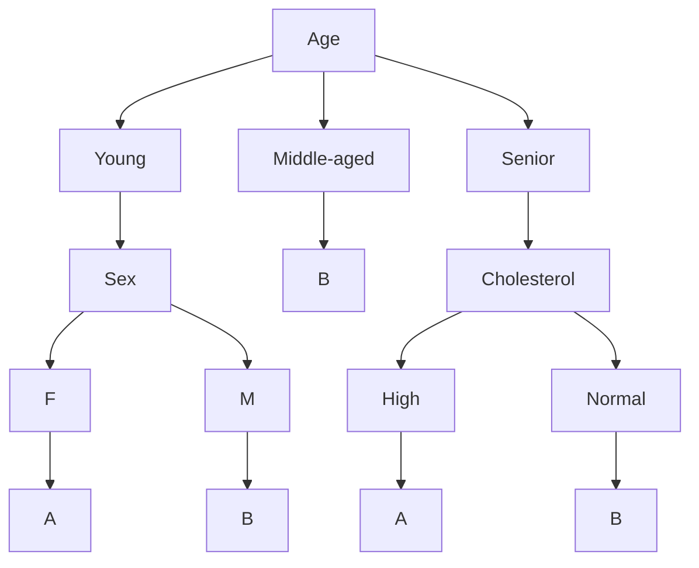

## Building Supervised Learning Modules

### Classification and Regression

#### Classification

Classification

- a supervised machine learning method
- uses fully trained models to predict label on new data
- labels form a categorical variable with discrete values

What is supervised learning?

- understands data in context when answering a question
- ensures accuracy in predictions
- model adjusts the data to fit the algorithm and classifies it accordingly

Application of classification

- problems expressed as association between features and target variables
- used to build apps for:
  - email filtering
  - speech-to-text
  - handwriting recognition
  - biometric identification
  - document classification
  - etc.
- Churn prediction
  - if customer will discontinue service
- Customer segmentation:
  - predict the category of a customer
- Advertising:
  - predict if a customer will respond to a campaign

Use cases of classification

- loan default prediction
- multi class drug prescription

Classification Algorithms

- Naive Bayes
- Logistic Regression
- Decision Trees
- K-nearest neighbors
- Support Vector Machines
- Neural Networks

Multiclass classifiers

- algorithms like:
  - Logistic Regression
  - Decision Trees
  - K-nearest neighbors
- can classify multiple distinct labels

Multiclass prediction

- classification algorithms used as components for multiclass classifiers
- strategies:
  - one-versus-all
  - one-versus-one

One-versus-all strategy

- Binary classifier
  - one for each class label
- assigned a single label that defines target class
- task
  - binary prediction for every data point for a one-versus-the-rest classifier
- K-classes
  - K binary classifiers

One-versus-one strategy

- is this or is that? question
- given a set of classes, create all possible combinations in the classes
  - for each pair of classes, it is checked which of those pairs fit more
  - then it is repeated for all the combinations
- voting scheme
  - by popularity
  - what if there is a tie?
    - check the probability values or maybe use one-versus-all strategy

#### Decision Trees

Decision Tree

- an algorithm that can be envision as a flow chart for classifying data points
- each internal node corresponds to a test
- each branch corresponds to the result of the test
- each terminal, or leaf node, assigns its data to a class

How to build a decision tree?

- consider features of a data set
- example in medical study: age, sex, blood pressure, and cholesterol
  - the target is the drug that corresponds to the features
- use training part of data set to build decision tree
- use decision tree to predict class of unknown patient

Patient Classifier Example

- decision to prescribe Drug A or B based on historical data
- for middle-aged patient, decision tree suggests Drug B
- for young female, decision tree suggests Drug A

Decision tree structure

Training a decision tree

1. Start with a seed node and labeled training data
2. Find the feature that best splits the data
3. Each split partitions the node's input data
4. Repeat the process for each new node

**It stops when each node has only 1 feature or model has run out of features or a pre-selected criteria is met**

Tree Pruning

- Stop growing the tree when:
  - maximum tree depth is reached
  - minimum number of data points in a node has been exceeded
  - minimum number of samples in a leaf has been exceeded
  - decision tree has reached maximum number of leaf nodes
- Can also drop or cut branches from the tree when it doesn't affect model performance that much

Why prune?

- pruning simplifies decision tree
- pruned tree is more concise and easier to understand
- pruning results in a better predictive accuracy
- avoids overfitting

Which is the best feature?

- decision trees are trees build using recursive partitioning to classify data
- select feature that best split data to train the tree
- common split measures are:
  - information gain
  - gini impurity

Pruning decision tree example:

- test cholesterol as the first feature
  - the tree assigns patients to two nodes: high and normal
- test patient sex as the second feature
- continue branching until reaching stopping criterion

What is entropy?

- measure of information disorder in a data set
- measure how random the classes in a node are
- if the classes are completely homogenous, entropy is 0
- if the classes are equally divided, entropy is 1

What is information gain?

- entropy of a tree before split - weighted after split
- opposite of entropy
- increases with the decrease in entropy

Advantages of decision trees

- model visualization
- interpretability
- analysis and prediction

#### Regression Trees

What is a regression tree?

- analogous to a decision tree that predicts continuous values
- classification: target is categorical
  - like true/false
- regression: target is continuous
  - like salary or prices
- regression tree: decision tree adapted to solve regression problems

Classification versus regression trees

| | Classification Trees | Regression Trees |
|---|---|---|
| Objective | Classify data into discrete sets | Predict continuous target variable |
| Target variable | categorical | float |
| Splitting criterion | gini impurity or entropy | variance reduction |
| Prediction at leaf nodes | class label majority vote | average value of target values |
| Example Use cases | spam detection, image classification, medical diagnosis | predicting revenue, temperatures, wildfire risks |

Creating regression trees

- recursively split data set into subsets to maximize information gain
- generates a tree-like structure
- minimizes randomness of predicted value assigned to split nodes
- example:
  - data
    - split into 2 subsets comparing with alpha
    - left node and right node is assigned

Predicting values

- Prediction value:
  - mean of target values
    - y_hat = 1/n * (summation of i=1 to n) * y_i
- Alternative value:
  - median of target values
  - better for skewed data
  - more expensive to compute

Splitting criterion

- features that minimize error between actual and predicted value
- uses MSE: 1/n * (summation of i=1 to n) * (y_i - y_hat)^2
  - a measure of target variance

Quality of split:

- weighted average of MSEs of each split:
  - mse_avg = 1/n_total * (n_left * mse_left + n_right * mse_right)
    - n = number of observations
    - the lower the value, the lower the variance > higher quality
    - the higher the value, the higher the variance

Choosing the best split

- for each trial split of each remaining feature:
  - calculate MSE for left and right nodes
  - calculated weighted average of MSEs
  - select split with smallest value

Categorical feature splits

- binary feature
  - separate into two classes
  - calculate weighted average of MSEs
  - no minimization needed
- multi class feature
  - use one-vs-one or one-vs-all
  - calculate weighted average for each binary split

Continuous features trial thresholds

- does not scale well to big data
  - sort features values: x_i <= x_j for all i < j
  - drop duplicates: x_i < x_j for all i < j
  - define midpoint thresholds: alpha_i = (x_i + x_{i+1}) / 2
  - choose alpha that minimizes weighted MSE
- for large data set, select a sparse subset
- assumption: target values are uniformly distributed
- consider distribution with sampling thresholds

### Other Supervised Learning Models

#### Supervised Learning with SVMs

#### Supervised Learning with KNN

#### Bias, Variance, and Ensemble Models
